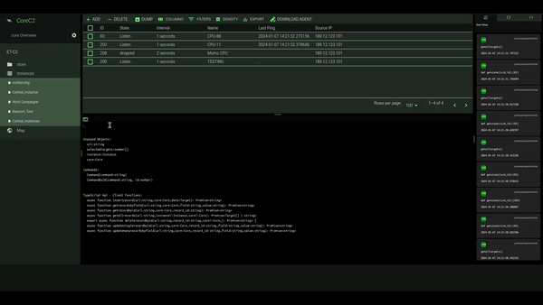
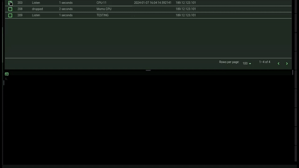

CoreC2 🛰️
============

CoreC2 is a Command and Control Framework for Penetration Testing and Red team Operations
the Framework is a multi component Application for remote Administration of target Devices.

The Components

1. Server   
   - Local Sqlite Database
   - Flask web API🐍
   - bash Tools
   - MongoDb ( In development❗)

2. Listener
   - Python ICMP byte decoder and Request Proxy 🐍

3. Implant - (not in Repos)
   - 🇨++
   - Rust ( Comming Soon❗)

4. Clients
   - React-TypeScript Web Client (TypeScript)
   - CommandLine Client  (Python🐍)


> ⚠️ Links comming soon! still in Deployement testing.

#   1. Server 
the Server is a web api written in Flask to manage the State of the Targets/Clients/Listener and to Manage  incoming callbacks from our Listeners/Proxies.

the API here is used to manipulate what i call the **Core** (hence the name). the Core is the Transaction Agreement between the Clients and Server.
### Todo
- [x] Insert/Update/Deletes
- [x] Authentication and sessions
- [x] Sockets!


#   2. Listener/Proxies
The ***Listener/Proxy*** albeit the smallest component of all is the most important, the incomming beacons are ICMP requests which adds stealth to our Implants Beacon Mechanism.

Acting as a Proxy between the Implants and Server the Listner on behalf of the implants will make request to the server for any Tasks it needs. the hardcoded

The Proxies can be Hosted on any server provided it has a public IP address that can be reached by Implants.
it uses Scapy to sniff icmp packets in the incomming traffic, and therefore Should Listen on ***0.0.0.0*** to capture icmp.

Users can configure to their liking depending on the box they use to host this. it can also be hosted in Proximity to the server on the same machine. however over-the-Internet gives a more distributed
approach. 


### Todo
- [x] ICMP Interpreter and Switch?
- [x] Proxy Status Achieved.
- [ ] Size for Icmp payload? 
- [ ] Horizontal Scaling (Kubernetes)?
- [ ] Multi Icmp bounce back. (ex: implant sends 1 ping Proxy sends back 4) 


#   3. Implant 

The Implant is C++ program that can use various different protocols to beacon to it's handlers. it Primarily reaches out to it's listeners for actions but occasionally directly hits the server for any signification actions  it needs to do. 
### Todo
- [x] Icmp Beacons
- [x] Startu Program Execution 
- [x] Handle Process Exfiltrate Results. 
- [x] Failover beacons (if the server can't be reached through the proxy hit the service directly)
- [ ] Auto Persistence 
- [ ] Sticky Shell. (a **REALLY** would be Nice to have )
- [ ] Discord Hooks? Other Hooks? Maybe? 


#   4. Clients 

The Clients are obvisouly the stars of the shows because it's the interface between you and absolute destructions. kidding.
the Web Client is a Typescript React Single Page Web Application for the management of the Targets and Instances in your core.

The Web Client is the more user friendly way to administrate, it features. 

1. Core Web Client   
   - Target Create/read/delete/update
   - Instance Create/read/delete/update
   - Core creation.
   - Full Core Configuration panels for managing Routing services.
   - Script Routines with your target
   - Exposed TypeScript Client Functions 
   - Fully loaded Javascript/Code Terminal 
   - GridView for Target Visualisation with GridView Functionality
   - Object Viewer
   - Script Viewer
   - DataStorage for files and dumps
   - Map with Topology View for instance/Targets/Proxies using Jquery
   ( in Development❗)




1. Command Line Client
    - Command Clients have the same non Visual Features for the Web Client however it is more of a DIY client,
    - Provided is mockup of the HTTP requests however a more documented version of the list of endpoints will soon be released ( in Progress❗)

2. the Client Functions.
   
   as previously Mentioned a more documented list of endpoints will be provided. the Web client still provides a decent enough API to make things happen on Target machines.
   
   for example in the Terminal in your instance view you can run commands like: 


```typescript

//get help?
        help()

//Example Script find out if your target has wireless interface
         Command(`powershell -command "& {if (Get-NetAdapter |     Where-Object { $_.InterfaceDescription -like '*Wireless*' }) { Write-Host 'Your workstation has a wireless interface.' } else { Write-Host 'No wireless interface found on your workstation.' }}"`);

//Write a File on target?
        Command("cmd.exe /C ipconfig > %USERPROFILE%\\Desktop\\testing.txt"); 

//get Enviroment?
        Command('cmd.exe /C echo %USERPROFILE%');

//get Enviroment by ID?
        CommandById('cmd.exe /C echo %USERPROFILE%',10);
```

Example of getting Targets Profile




